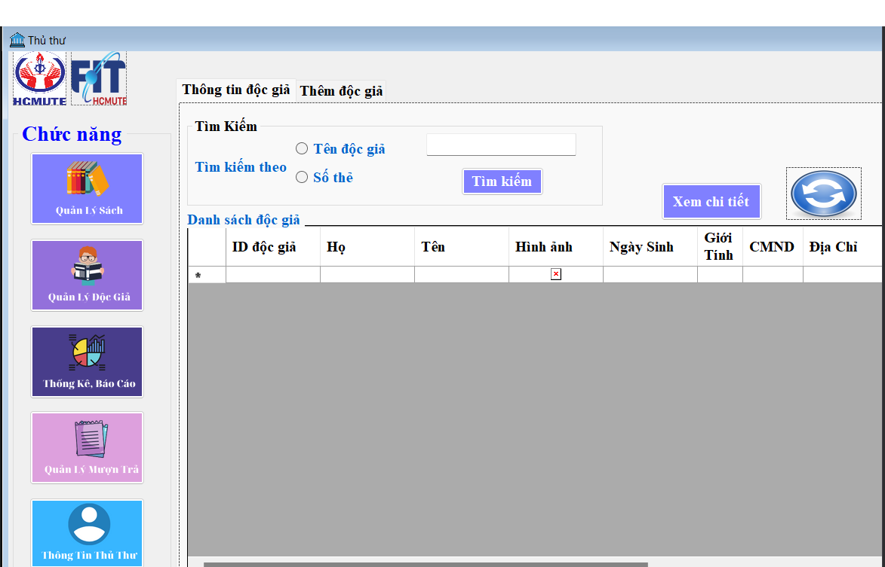

# Library management applycation use Ado.net
## A part of the program's interface

## Program functions
- Manage employees, search, add, edit, delete employees
- Manage readers, search, add, edit, delete employees
- Manage book borrowing, book return, search, add, edit, delete books
- Manage books, search, add, edit, delete books
## SQL code to create database (Data_DoAn_DBMS)

- Create table, create data for table
- Create trigger (trigger auto for automate the loan and return processes, auto update data,login,..)
- Create procedure (add book, give book back,...)
- Create view (book information, list reader, staff,..)
- Create function (search book, search staff, update date,..)
